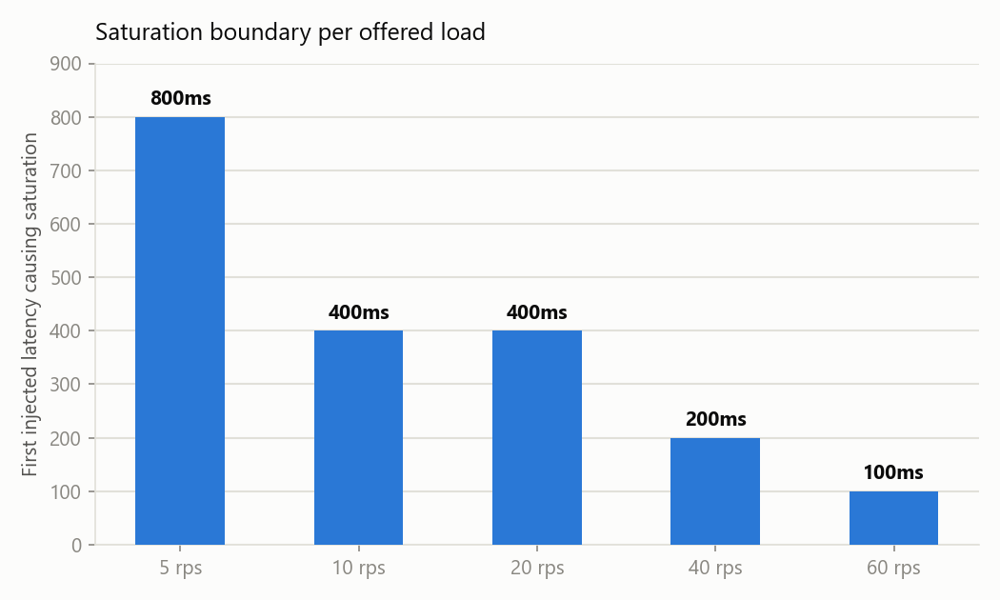
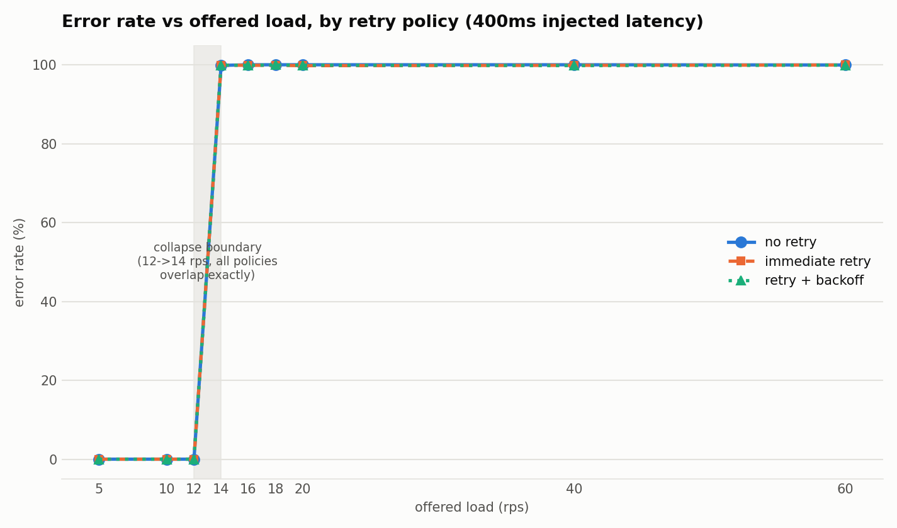
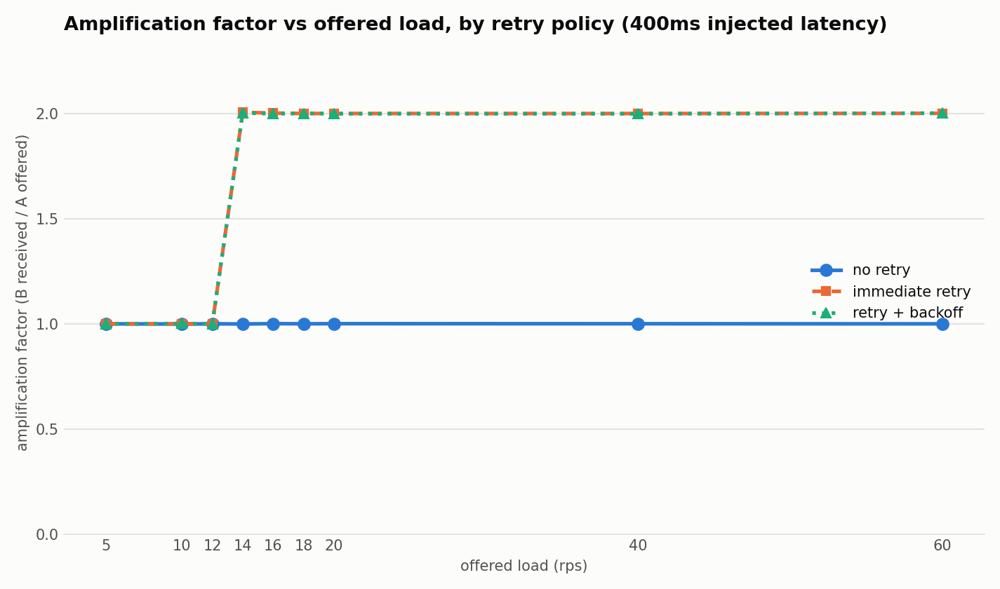
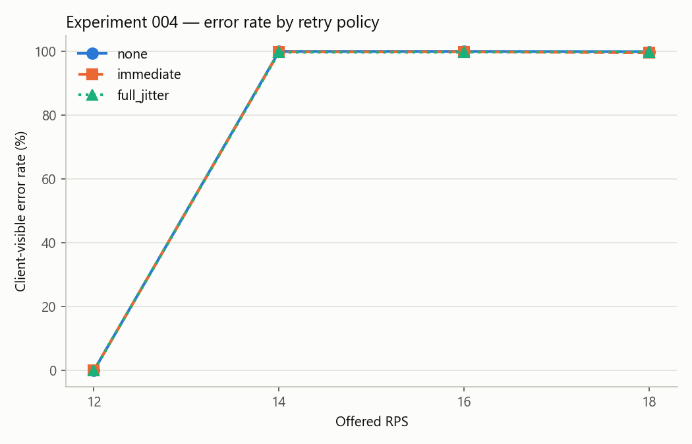
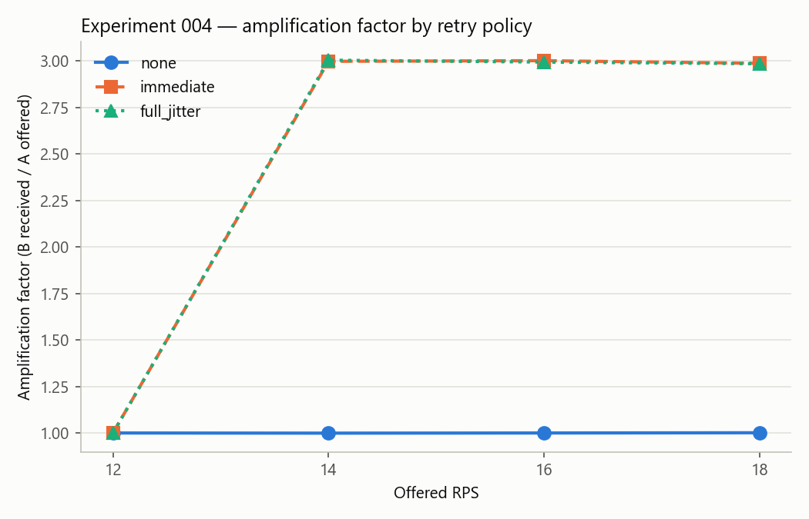
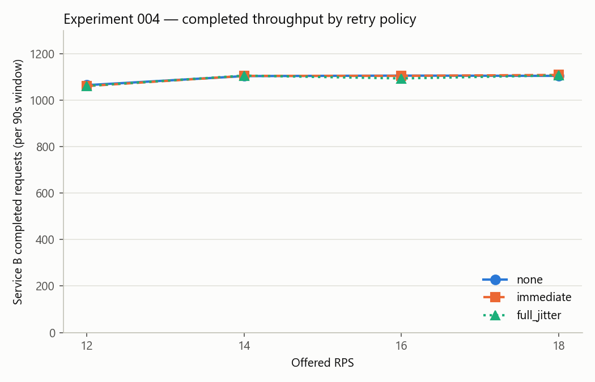
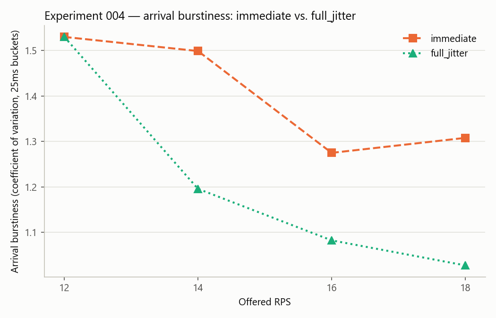

# FaultLab

A reproducible laboratory for injecting real failures into small systems,
observing how those failures propagate, and explaining why.

```
Load Generator (k6) -> Service A (FastAPI, retry client + circuit breaker) -> Service B (FastAPI + asyncpg) -> Toxiproxy -> PostgreSQL
```

Service A is a thin HTTP client with a configurable retry policy (none /
immediate / retry-with-backoff / exponential backoff with full jitter) and a
circuit breaker that can wrap the call to Service B. Service B owns the
bounded connection pool and is the one instrumented behind Toxiproxy's
injected network latency, on a real PostgreSQL database. Every component in
the request path is real.

## Current experiments

| Experiment | Status | Key finding |
|---|---|---|
| [001 — dependency latency](#experiment-001--database-latency-propagation) | closed | Injected DB latency propagates harmlessly until the connection pool saturates; the latency needed to trigger saturation drops sharply as offered load rises. |
| [002 — retry amplification](#experiment-002--retry-amplification) | closed | Retries roughly double load on an already-saturated dependency without increasing completed throughput, and don't measurably shift the collapse boundary. |
| [003 — circuit breaker](#experiment-003--circuit-breaker) | closed | A minimal breaker cuts load reaching the saturated dependency by up to ~44%, cuts client-visible errors by up to ~61 points, and every recovery probe succeeded — confirming the collapse is a queueing effect, not a hard failure. |
| [004 — retry scheduling](#experiment-004--retry-scheduling-backoff--jitter) | closed | Full jitter measurably desynchronizes retry arrivals at every saturated RPS tested, but that desynchronization doesn't move amplification, error rate, or completed throughput — a fixed-capacity pool, not burst-induced overflow, remains the dominant constraint once saturated. |
| [005 — connection pool capacity](experiments/005-connection-pool-capacity/README.md) | closed | The collapse boundary scales exactly linearly with pool size (10→20→40, RPS 14→28→56, all at a 1.4 RPS-per-connection ratio) with no curvature — a bigger pool moves the collapse point but doesn't soften it: client-visible success still collapses to near 0% at the new boundary, while Service B keeps completing about the same amount of real work. |

## Running the stack

```
docker compose up -d --build postgres toxiproxy toxiproxy-init service-b service-a
```

Wait for `service-a` to report healthy, then confirm it can reach the
database through the proxy:

```
curl http://localhost:8000/healthz
curl http://localhost:8000/work?id=1
```

## Running a single experiment

```
python scripts/run_experiment.py --rps 20 --latency-ms 100 --retry-policy none --breaker off
```

`--retry-policy` is `none` (default), `immediate`, `backoff`, or
`full_jitter` (exponential backoff with full jitter, added for Experiment
004) — it sets Service A's retry behavior for the run. Any policy other
than `none` gives a request up to 3 total attempts (raised from 2 for
Experiment 004 — see that section for why). `--breaker` is `off` (default)
or `on` — it wraps Service A's call to Service B in a circuit breaker
(closed/open/half-open, sliding failure-rate trip, single-probe recovery).
Retries and the breaker are independent toggles, but Experiment 003 always
runs with retries disabled to isolate the breaker as the only variable.
`--trace-arrivals` enables Service B's optional per-request arrival trace
(off by default, added for Experiment 004 — see that section).
This configures the Toxiproxy latency toxic on the Service B <-> PostgreSQL
link, polls Service A's snapshot + breaker state and Service B's snapshot
once a second, runs a k6 load test (30s warmup / 90s measurement / 15s
cooldown by default), and writes everything to `experiments/runs/<run_id>/`:

- `metadata.json` — run configuration (rps, injected latency, retry policy, breaker enabled, pool size, timeout)
- `results.json` — load generator summary plus `service_a`/`service_b`/`breaker`
  metric summaries and the derived `amplification_factor` / `retry_rate` /
  `retry_success_rate` / `probe_success_rate`
- `proxy_state.json` — the Toxiproxy configuration used
- `raw_app_samples.jsonl` — per-second snapshots from both services plus the breaker
- `arrival_trace.csv` — one arrival timestamp per request reaching Service B, only when `--trace-arrivals`/`--exp004` is used
- `loadgen/summary.json`, `loadgen/raw.jsonl` — k6 summary and per-request events

## Running the full sweep

```
python scripts/run_experiment.py --sweep
python scripts/run_experiment.py --phase-a   # Experiment 002: 400ms x 3 retry policies x RPS {5,10,20,40,60}
python scripts/run_experiment.py --phase-b   # same, at 200ms
python scripts/run_experiment.py --exp003    # Experiment 003: 400ms, retries off, breaker off/on x RPS {12,14,16,18}
python scripts/run_experiment.py --exp004    # Experiment 004: 400ms, breaker off, {none,immediate,full_jitter} x RPS {12,14,16,18}, arrival tracing on
```

`--sweep` runs RPS in `[5, 10, 20, 40, 60]` against injected DB latency in
`[0, 50, 100, 200, 400, 800]` ms, per the Week 1 plan.

## Analyzing results

```
python scripts/analyze_results.py
python scripts/analyze_results.py --csv experiments/summary.csv
```

Prints a table across all completed runs and flags the first (rps, latency)
point per retry policy where the system saturates: error rate above 0%, any
connection-pool acquisition timeouts on Service B, or its pool running at
full configured size. Injected latency alone always makes requests slower —
that's just propagation, not saturation, so it isn't used as a signal on
its own.

## Experiment 001 — database latency propagation

**Question.** How does injected database latency interact with offered
load — where does a healthy backend stop absorbing a slower dependency and
start failing?

**Method.** Full sweep: RPS `[5, 10, 20, 40, 60]` × injected DB latency
`[0, 50, 100, 200, 400, 800]` ms, 30 runs (`experiments/summary.csv`).

**Finding.** At low offered load, injected latency propagated almost
linearly into request latency with no failures — the pool had spare
capacity to absorb slower connections. As offered load increased, the
connection pool became the limiting resource: the latency needed to
trigger saturation dropped from 800ms at 5 RPS to just 100ms at 60 RPS.
Failures were driven by connection-pool acquisition timeouts, not query
timeouts — the collapse was caused by resource contention on the pool, not
by the database query itself running slow.

All figures below are generated from the canonical 30-condition
experiment matrix (`experiments/summary.csv`).




## Experiment 002 — retry amplification

**Question.** When a client (Service A) retries a slow dependency (Service
B), does that help it recover, or does it amplify overload? And does
retrying shift the point where the system collapses to a lower offered
load?

**Method.** Service A was split off from the database: Service B is a copy
of the original Service A, now owning the connection pool behind Toxiproxy;
Service A became a thin HTTP client with a configurable retry policy
(`none`, `immediate`, `backoff` with a random 50-100ms delay). At a fixed
400ms injected latency, 27 runs swept RPS `[5, 10, 12, 14, 16, 18, 20, 40,
60]` across all three retry policies (`experiments/summary_002.csv`) — the
finer 12/14/16/18 points were added specifically to resolve the collapse
boundary after the initial 5/10/20/40/60 sweep showed it as a step function
between 10 and 20 RPS.

*Methodology note:* the initial sweep's RPS 40 and 60 conditions showed
Service B receiving less traffic than Service A sent, or none at all —
Service A's `httpx.AsyncClient` was relying on its library-default 100
connection limit, which silently failed requests client-side (before they
ever reached Service B) once concurrency exceeded that under retry-doubled
load. Raising the limit explicitly (`httpx.Limits(max_connections=1000)`)
and re-running the affected conditions confirmed the client was the
artifact, not Service B's database pool.

**Finding.** Below saturation (RPS 5-12), retries were dormant — there was
nothing to retry, so `immediate` and `backoff` were indistinguishable from
no retries at all (amplification ≈ 1.0, 0% errors). All three policies
collapsed at the *same* boundary, between 12 and 14 RPS, to the RPS level
— retrying did not shift the collapse point measurably. Past that boundary,
retries amplified load on Service B by almost exactly 2x (one retry = two
attempts) while Service B's real successful-query throughput stayed flat
around 1,100 requests per 90-second window regardless of retry policy —
retries added load without adding recovery. The collapse itself was sharp
rather than gradual: at RPS 12 the system ran clean end to end, and at RPS
14 it was already at ~100% errors, consistent with classic queueing
collapse once offered load exceeds a fixed service capacity.

Given retries showed no measurable effect on the collapse boundary at
400ms, a second latency sweep (Phase B) was judged unlikely to change that
qualitative conclusion and was not run — Experiment 002 was closed on this
result.





## Experiment 003 — circuit breaker

**Question.** Can failing fast (a circuit breaker) reduce the load a
saturated Service B receives — and does it improve client-visible success —
compared to Experiment 002's finding that retries just add ~2x overhead
once saturated?

**Method.** A minimal three-state breaker (closed / open / half-open) was
added to Service A, wrapping only the HTTP call to Service B — not layered
with retry logic. It trips on a sliding failure-rate window (last 20
*forwarded* requests, opens at ≥50% failure — short-circuited requests
never feed this window, or the breaker would be measuring its own fail-fast
output instead of Service B's real health); after a 2s cooldown it allows
exactly one half-open probe via an atomic flag, so concurrent requests
during recovery still fail fast rather than all becoming probes. Retries
were disabled entirely for this experiment (fixed to `none`) to isolate the
breaker as the only independent variable. At the fixed 400ms latency and
the exact RPS boundary Experiment 002 identified (12/14/16/18), 8 runs
swept breaker off vs on (`experiments/summary_003.csv`).

**Finding.** The breaker had no false positives — at RPS 12 (below the
collapse boundary) it never opened, identical to breaker-off. Above the
boundary (RPS 14-18) it opened repeatedly and stayed open for a large share
of each run (24-42% of the measurement window), and the effect was
substantially stronger than the hypothesis anticipated:

| RPS | Error rate, off | Error rate, on | Amplification, off | Amplification, on | Requests reaching B, off | on |
|---|---|---|---|---|---|---|
| 14 | 100% | 38.5% | 1.00 | 0.76 | 1,244 | 940 |
| 16 | 99.9% | 58.9% | 1.00 | 0.64 | 1,422 | 908 |
| 18 | 99.9% | 69.6% | 1.00 | 0.57 | 1,596 | 897 |

Client-visible errors dropped by up to 61 percentage points, not just
downstream load. Short-circuited requests resolved in well under a
millisecond (vs. multi-second timeouts when forwarded), confirming genuine
fail-fast behavior rather than failing for some other reason.

The most interesting result wasn't the amplification reduction — it was
that **every single half-open probe succeeded** (100% probe success rate
at every saturated RPS tested). That confirms the read from Experiment 002:
this collapse is a queueing/capacity effect, not a hard failure — Service B
was never actually broken, just overwhelmed, so briefly relieving pressure
let both probes and residual traffic through the closed window succeed
reliably. That is also why client-visible success recovered so much: the
breaker isn't just protecting Service B, it's giving the queue room to
drain.


## Experiment 004 — retry scheduling (backoff + jitter)

**Question.** Experiment 002 showed immediate retries add ~2x load on an
already-saturated dependency without adding completed throughput. Is the
problem retrying itself, or specifically *how* retries are scheduled? Can
exponential backoff with full jitter desynchronize retry waves and reduce
that overload, compared to immediate retries?

**Method.** Same topology as Experiment 002 (breaker absent, not just off —
combining it with retry scheduling would confound which mechanism caused
any change). Two changes from Experiment 002's setup, both deliberate:

- **Retry budget raised from 2 to 3 total attempts.** With a single retry,
  comparing scheduling policies only compares one delay's length — jitter's
  actual purpose (decorrelating a *wave* of clients across multiple rounds)
  never gets exercised. Three attempts is the minimum that creates more
  than one retry wave while staying bounded.
- **A new optional per-request arrival trace at Service B** (`arrival_ns`
  only — no payload, no headers, no request ID; gated behind
  `--trace-arrivals`/`--exp004`, off by default so Experiments 001-003 are
  unaffected). The existing ~1Hz snapshot polling can't distinguish a
  synchronized retry burst from a smoothed one, since a 100-200ms backoff
  schedule lives entirely inside one polling bucket — without this trace,
  the experiment could only measure the hypothesis's *outcome*, not its
  claimed *mechanism*.

Three retry policies — `none`, `immediate`, `full_jitter` (100ms/200ms
exponential base, full jitter: `random(0, base)`) — swept across the exact
RPS boundary Experiments 002/003 identified (12/14/16/18) at a fixed 400ms
injected latency, 12 runs (`experiments/summary_004.csv`). Fixed backoff
was deliberately excluded from this sweep: it shifts a retry wave in time
without spreading it, so it doesn't test the desynchronization mechanism
under investigation.

**Finding.** The outcome metrics replicate Experiment 002 almost exactly.
The collapse boundary is unchanged — still exactly RPS 12 → 14 for all
three policies. `immediate` and `full_jitter` are statistically
indistinguishable on amplification (~3.0x, tracking the new 3-attempt
budget), client-visible error rate (~99.6-99.9%), and Service B's completed
throughput, which stays flat around 1,100-1,110 requests per 90s window
regardless of policy:

| RPS | Policy | Error rate | Amplification | B completed |
|---|---|---|---|---|
| 12 | all three | 0% | 1.00 | ~1,062 |
| 14 | `immediate` / `full_jitter` | ~99.9% | ~3.00 | ~1,105 |
| 16 | `immediate` / `full_jitter` | ~99.9% | ~2.99 | ~1,100 |
| 18 | `immediate` / `full_jitter` | ~99.6-99.9% | ~2.98-2.99 | ~1,108 |

Taken alone, that would read as "jitter didn't help" — not a very
interesting result. The arrival trace is what makes this a stronger
finding than that. Bucketing each run's arrival trace into 25ms windows and
computing the coefficient of variation (a burstiness measure — lower means
smoother, more evenly spread arrivals) shows full_jitter consistently,
monotonically reducing burstiness at every saturated RPS tested:

| RPS | `immediate` arrival CV | `full_jitter` arrival CV |
|---|---|---|
| 14 | 1.499 | 1.196 |
| 16 | 1.275 | 1.082 |
| 18 | 1.308 | 1.027 |

So the experiment answered two separate questions, not one. **Does full
jitter desynchronize retries? Yes, consistently.** **Does that
desynchronization improve system-level outcomes? No — not in this system.**
The results are consistent with the fixed-size connection pool remaining
the dominant bottleneck after saturation: although full jitter reduced
arrival burstiness, the throughput ceiling stayed unchanged, suggesting
that smoothing arrivals alone was insufficient to overcome the resource
constraint. Once Service B's 10-connection pool is the binding constraint,
a smoother arrival pattern still funnels into the same fixed-rate drain —
retries add the same ~3x wasted load either way, just spread out
differently in time.

This closes the four-experiment arc that opened with Experiment 001:
001 identified the mechanism (pool saturation), 002 showed a plausible
mitigation makes things worse (naive retries amplify without helping), 003
showed a mitigation that works (fail-fast + probe), and 004 verified that a
second plausible mitigation's proposed mechanism is real — full jitter
does desynchronize retries — while showing that mechanism alone doesn't
overcome a fixed-capacity bottleneck. Eliminating a plausible hypothesis
with direct mechanistic evidence, not just an absence of effect, is why
this counts as a completed result rather than an inconclusive one.








