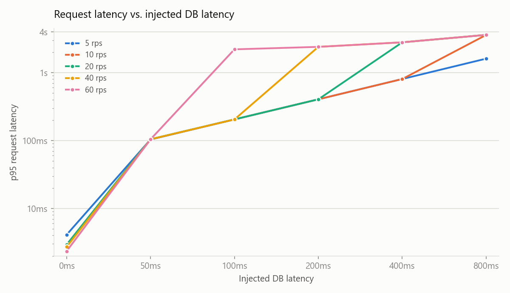
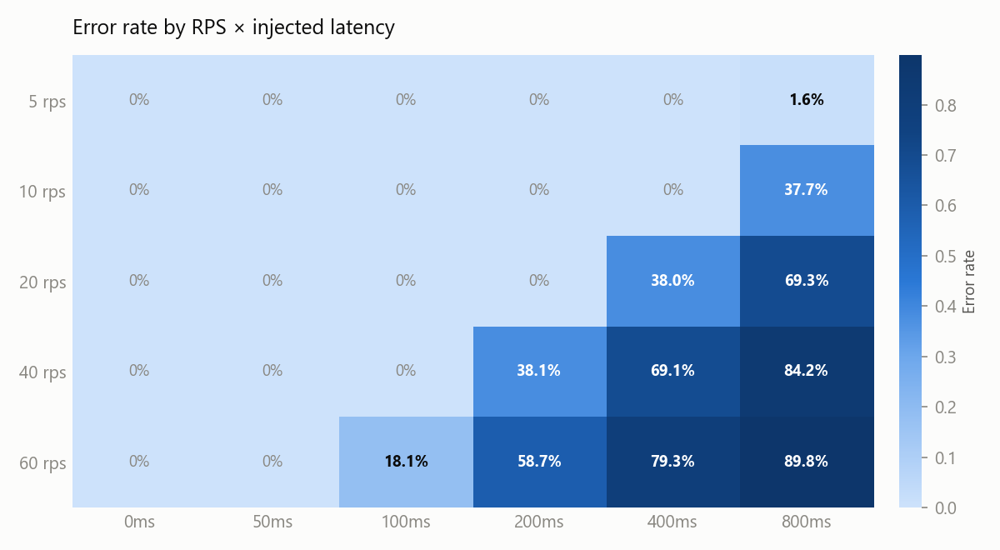

# Experiment 001 -- Database latency propagation

**Status.** closed

**Question.** How does injected database latency interact with offered
load — where does a healthy backend stop absorbing a slower dependency and
start failing?

**Method.** Full sweep: RPS `[5, 10, 20, 40, 60]` × injected DB latency
`[0, 50, 100, 200, 400, 800]` ms, 30 runs (`summary.csv`).

**Finding.** At low offered load, injected latency propagated almost
linearly into request latency with no failures — the pool had spare
capacity to absorb slower connections. As offered load increased, the
connection pool became the limiting resource: the latency needed to
trigger saturation dropped from 800ms at 5 RPS to just 100ms at 60 RPS.
Failures were driven by connection-pool acquisition timeouts, not query
timeouts — the collapse was caused by resource contention on the pool, not
by the database query itself running slow.

All figures below are generated from the canonical 30-condition
experiment matrix (`summary.csv`).

