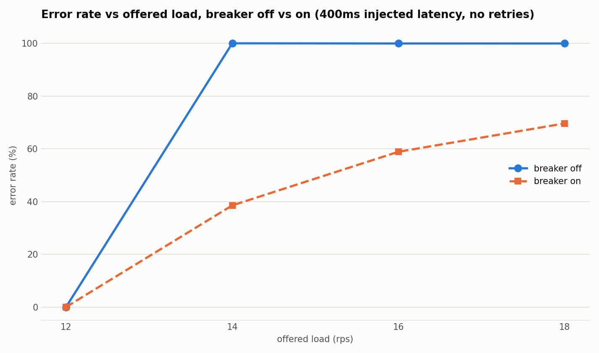
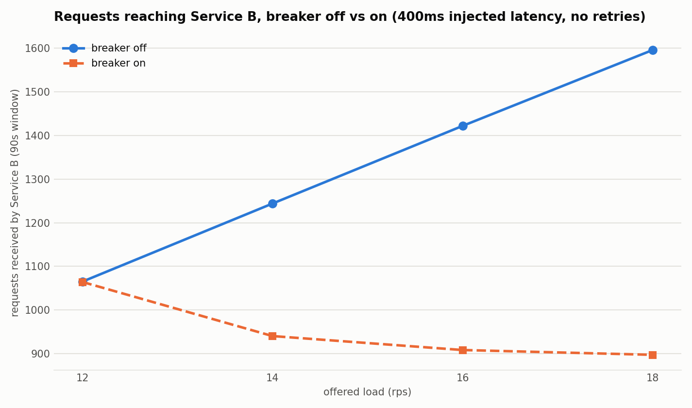

# Experiment 003 -- Circuit breaker

**Status.** closed

**Question.** Can failing fast (a circuit breaker) reduce the load a
saturated Service B receives — and does it improve client-visible success —
compared to Experiment 002's finding that retries just add ~2x overhead
once saturated?

**Method.** A minimal three-state breaker (closed / open / half-open) was
added to Service A, wrapping only the HTTP call to Service B — not layered
with retry logic. It trips on a sliding failure-rate window (last 20
*forwarded* requests, opens at ≥50% failure — short-circuited requests
never feed this window, or the breaker would be measuring its own fail-fast
output instead of Service B's real health); after a 2s cooldown it allows
exactly one half-open probe via an atomic flag, so concurrent requests
during recovery still fail fast rather than all becoming probes. Retries
were disabled entirely for this experiment (fixed to `none`) to isolate the
breaker as the only independent variable. At the fixed 400ms latency and
the exact RPS boundary Experiment 002 identified (12/14/16/18), 8 runs
swept breaker off vs on (`summary.csv`).

**Finding.** The breaker had no false positives — at RPS 12 (below the
collapse boundary) it never opened, identical to breaker-off. Above the
boundary (RPS 14-18) it opened repeatedly and stayed open for a large share
of each run (24-42% of the measurement window), and the effect was
substantially stronger than the hypothesis anticipated:

| RPS | Error rate, off | Error rate, on | Amplification, off | Amplification, on | Requests reaching B, off | on |
|---|---|---|---|---|---|---|
| 14 | 100% | 38.5% | 1.00 | 0.76 | 1,244 | 940 |
| 16 | 99.9% | 58.9% | 1.00 | 0.64 | 1,422 | 908 |
| 18 | 99.9% | 69.6% | 1.00 | 0.57 | 1,596 | 897 |

Client-visible errors dropped by up to 61 percentage points, not just
downstream load. Short-circuited requests resolved in well under a
millisecond (vs. multi-second timeouts when forwarded), confirming genuine
fail-fast behavior rather than failing for some other reason.

The most interesting result wasn't the amplification reduction — it was
that **every single half-open probe succeeded** (100% probe success rate
at every saturated RPS tested). That confirms the read from Experiment 002:
this collapse is a queueing/capacity effect, not a hard failure — Service B
was never actually broken, just overwhelmed, so briefly relieving pressure
let both probes and residual traffic through the closed window succeed
reliably. That is also why client-visible success recovered so much: the
breaker isn't just protecting Service B, it's giving the queue room to
drain.

